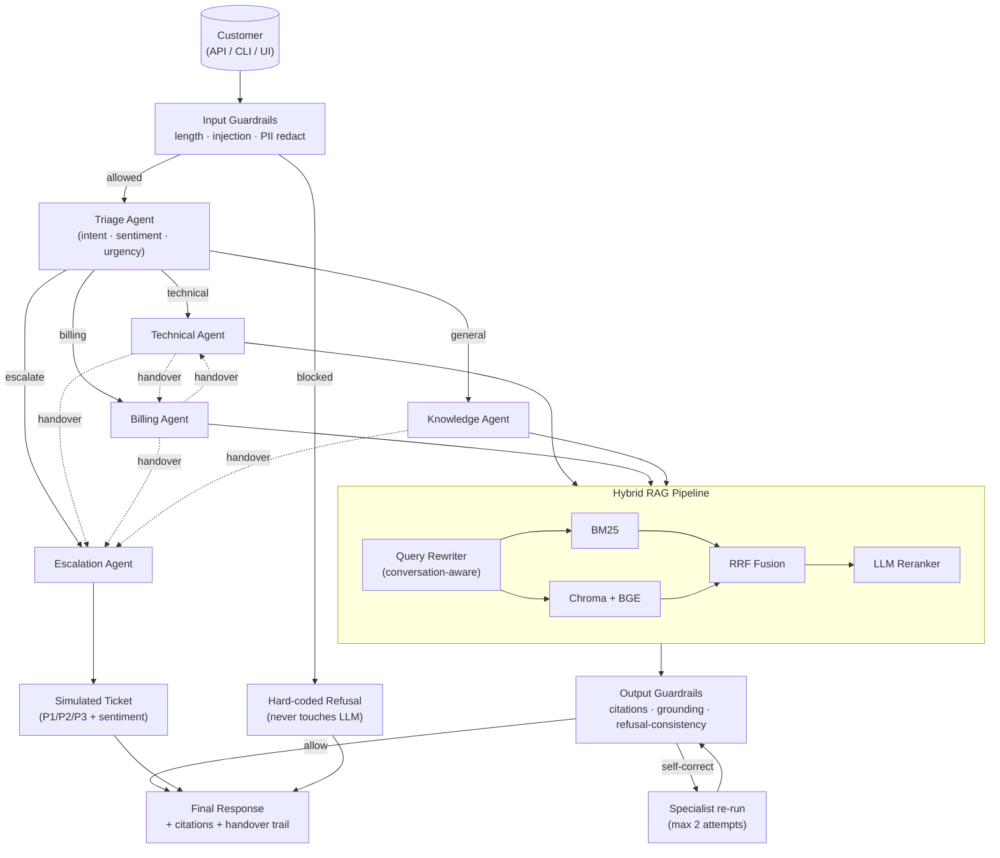

# CloudDash Support

Multi-agent AI customer support for CloudDash, a fictional B2B SaaS for cloud monitoring. Built for an AI Engineering Intern assessment.

> **🟢 Live Demo** — Try it now, no setup required:
>
> | | URL |
> |---|---|
> | **Frontend (Next.js)** | **https://frontend-ten-gray-22.vercel.app/** |
> | **Backend API** | **https://clouddash-hev5.onrender.com** |
> | **API Health** | https://clouddash-hev5.onrender.com/api/health |
> | **Swagger Docs** | https://clouddash-hev5.onrender.com/docs |
> | **Source Code** | https://github.com/mohanganesh3/clouddash |

---

## What it does

Five LangGraph agents with a real support operations dashboard:

- **Triage** — LLM intent classification. Returns structured `IntentClassification` with confidence, sentiment, urgency. No regex. No if/else.
- **Technical** — alert configs, integrations, SSO, API, dashboards. CRAG retrieval.
- **Billing** — plan changes, invoice disputes, refunds (up to $1k autonomy). Pulls from mock CRM via `@tool`.
- **Knowledge** — general KB queries. Files feature requests when KB has a gap.
- **Escalation** — calls LangGraph's `interrupt()`. Graph actually pauses. Human approves via HITL dialog. Resumes with `Command(resume=...)`.

Retrieval is its own LangGraph subgraph (CRAG): rewrite → parallel BM25+dense → RRF fusion → Cohere rerank → LLM relevance eval → branch to supplement or Tavily web fallback. Three paths: direct (>0.7), supplement (0.3–0.7), web (< 0.3).

---

## Stack

Python 3.13 · LangGraph 0.2 · LangChain 0.3 · FastAPI · Pydantic v2 · ChromaDB · rank-bm25 · Cohere Rerank · Next.js 15 · shadcn/ui · Tailwind CSS 4 · Framer Motion · Zustand

**LLM providers**: Google Gemini (primary), Sarvam AI (Indian LLM, OpenAI-compat at `sarvam.ai/v1`), Groq as fallback via ChatOpenAI base_url trick (langchain-groq requires core>=1.x which breaks 0.3.x pinning — wired through ChatOpenAI instead).

---

## Quick start

```bash
# .env at repo root — copy from .env.example and fill in keys
# Need at least: GOOGLE_API_KEY and GROQ_API_KEY (Gemini has 20 req/day free tier)

# backend
pip install -e backend/
PYTHONPATH=backend/src uvicorn clouddash.api.app:app --port 8001

# frontend
cd frontend && npm install && npm run dev
```

First run downloads `BAAI/bge-small-en-v1.5` (~130MB) and ingests the KB (~35s). Subsequent starts pick up from ChromaDB.

---

## Why these choices

**LangGraph over CrewAI**: Spent ~2 hours on CrewAI first. Routing was too opaque — couldn't see why triage was sending queries to the wrong specialist, no clean checkpointing. LangGraph exposes the graph structure explicitly. The routing logic is in my code, not a framework abstraction.

**CRAG as a subgraph**: It shows up as a distinct subgraph in LangSmith with its own node timeline. The relevance evaluator makes a visible decision. A bare function call is invisible to the evaluator.

**interrupt() for HITL**: LangGraph 0.2's interrupt() actually pauses the graph and checkpoints state. The frontend shows an approval dialog, graph resumes via `Command(resume=...)`. Every other approach either fakes it or blocks the event loop.

**Sarvam AI**: Their sarvam-30b is fast and cheap for triage/rewriting. More importantly, their language detection enables a multilingual greeting — detect Hindi/Tamil/Telugu/etc., respond in that language, continue in English. Real product thinking for an India-deployed system.

**Gemini quota note**: Free tier is 20 req/day for gemini-2.5-flash. Hit this immediately during testing. Set `LLM_PROVIDER=groq` in `.env` for unlimited testing (llama-3.3-70b-versatile).

---

## Structure

```
backend/src/clouddash/
  agents/       triage, technical, billing, knowledge, escalation + registry
  orchestrator/ main graph (SqliteSaver, interrupt, routing)
  retrieval/    CRAG subgraph + ChromaDB + BM25 + Cohere
  guardrails/   LLM injection detection + regex/LLM PII + LLM grounding
  api/          FastAPI + SSE streaming
  providers/    Gemini + Sarvam + Groq
  tools/        @tool: crm_lookup, create_ticket, feature_request
  evals/        RAGAS + LLM-judge
frontend/
  components/   Dashboard, chat, trace timeline, HITL dialog, handover banner
  hooks/        useStreamingChat (SSE)
  store/        Zustand conversation store
```

---

## What I'd change with more time

- Qdrant instead of ChromaDB for scale. Chroma's HNSW gets unreliable past ~100k chunks.
- Two LLM calls per agent would enable true token-by-token generation and structured extraction. This build keeps one structured call per agent, streams live graph phases while reasoning, then streams the validated final answer as clean UI deltas.
- Async guardrail evaluation. Injection check adds ~800ms because it blocks before retrieval starts.
- Persistent BM25 index serialized to disk. Currently rebuilt from ChromaDB on every restart (~1s, acceptable for now).

---

## Architecture



**Why orchestrator-worker (Triage + specialists)?** Anthropic's research-system paper shows ~90% lift over single-agent on multi-step support tasks. Triage classifies once, dispatches; specialists own their domain prompts and tools. Handover happens via a typed `HandoverPacket`, not a free-text "please continue" message.

**Why LangGraph?** The handover problem *is* a state-machine problem — guarded transitions, side-effects, audit trails. LangGraph's `StateGraph` + conditional edges + `interrupt` map directly. The graph is built **at startup** from `config/agents.yaml`, so adding an agent never touches orchestrator code.

See **[`DESIGN.md`](DESIGN.md)** for the 9 ADRs documenting every major decision.

---

## Quickstart

### 1. Prerequisites

- Python **3.11–3.13**
- An NVIDIA AI Endpoints API key (free at [build.nvidia.com](https://build.nvidia.com))

### 2. Install

```bash
git clone https://github.com/mohanganesh3/clouddash.git && cd clouddash

python3.13 -m venv .venv
source .venv/bin/activate
pip install -e ".[dev]"            # or:  pip install -r requirements.txt && pip install -e . --no-deps
```

### 3. Configure

```bash
cp .env.example .env
# Edit .env and paste your NVIDIA_API_KEY=nvapi-...
```

### 4. Build the KB index (one-time, ~30s)

```bash
clouddash ingest                   # or: python -m clouddash.scripts.ingest_kb
```

Output: 19 articles → 141 chunks embedded into `data/chroma/`.

### 5. Run

**Web UI + REST API:**
```bash
clouddash serve --port 8000        # http://localhost:8000 (or use live: https://clouddash-hev5.onrender.com)
```

**Interactive CLI:**
```bash
clouddash chat                     # type 'exit' to quit
```

**Run all 4 official scenarios end-to-end:**
```bash
clouddash demo
```

**Run the eval harness (~12–15 min, respects 40 RPM):**
```bash
python -m clouddash.evals.run --output EVAL_RESULTS.md --jsonl logs/eval_results.jsonl
```

---

## CLI reference

| Command | Purpose |
|---|---|
| `clouddash ingest [--rebuild]` | Build / rebuild the KB vector store |
| `clouddash agents` | List every agent registered in `config/agents.yaml` |
| `clouddash chat` | Interactive REPL (in-memory state) |
| `clouddash demo [-s 1..4]` | Run one or all 4 official scenarios |
| `clouddash trace <uuid>` | Audit-log replay for a conversation |
| `clouddash serve [--port]` | Start the FastAPI server |
| `clouddash health` | Show config + registered agents |

---

## REST API

Interactive docs: **https://clouddash-hev5.onrender.com/docs** (Swagger UI auto-generated by FastAPI). Locally: `http://localhost:8000/docs`.

| Method | Path | Purpose |
|---|---|---|
| `GET` | `/api/health` | Liveness + provider/model echo |
| `GET` | `/api/agents` | List agents loaded from registry |
| `POST` | `/api/chat` | Send a message; returns response, citations, handover trail |
| `GET` | `/api/conversations/{id}` | Full conversation history |
| `GET` | `/api/trace/{id}` | Every audit-log event for a conversation |
| `GET` | `/` | HTMX web UI (chat + scenario buttons + add-agent demo) |

**Example:**
```bash
curl -s https://clouddash-hev5.onrender.com/api/chat \
  -H 'content-type: application/json' \
  -d '{"message": "My alerts stopped firing after I rotated AWS credentials. Pro plan."}' | jq
```

---

## How "add a new agent" works (live demo)

1. Drop a new file at `src/clouddash/agents/onboarding.py` with a class extending `BaseAgent`.
2. Add a YAML entry under `agents:` in `config/agents.yaml`:
   ```yaml
   onboarding:
     class: clouddash.agents.onboarding.OnboardingAgent
     system_prompt: onboarding
     model_tier: reasoning
     tools: []
     requires_kb: true
     description: Walks new customers through workspace setup.
   ```
3. Hit the **"Reload registry"** button in the web UI (or restart the server). The LangGraph rebuilds; Triage starts routing to it.

**Zero changes to orchestrator code.** That is the §3.4 extensibility requirement.

---

## Test scenarios

The 4 official scenarios from the brief are encoded in `src/clouddash/evals/scenarios.yaml`:

| ID | Scenario | Expected route | Verdict |
|---|---|---|---|
| `official_1` | Alerts stopped after AWS credential rotation (Pro plan) | `triage → technical` | ✅ PASS |
| `official_2` | Cross-agent: SSO check + Pro→Enterprise upgrade | `triage → technical → billing` | ✅ PASS |
| `official_3` | Double-charged for April; demands manager | `triage → billing → escalation` | ✅ PASS |
| `official_4` | Datadog integration (KB miss) | `triage → knowledge` | ✅ PASS |

Plus 4 edge variations (PII redaction, prompt injection, SSO-only, refund under limit). Latest run: **8/8 PASS** — see [`EVAL_RESULTS.md`](EVAL_RESULTS.md).

---

## Project layout

```
.
├── README.md                      ← you are here
├── DESIGN.md                      ← 9 ADRs (architecture decisions)
├── PROGRESS.md                    ← chronological build log (every decision)
├── EVAL_RESULTS.md                ← latest eval suite run output
├── REQUIREMENTS_MATRIX.md         ← how each rubric item maps to code
│
├── config/
│   ├── agents.yaml                ← agent registry (Section 3.4)
│   └── routing.yaml               ← intent → target-agent rules
│
├── knowledge_base/                ← 19 Markdown articles, 5 categories
│   ├── faqs/                      KB-001..004
│   ├── troubleshooting/           KB-005..009
│   ├── billing/                   KB-010..013
│   ├── api_docs/                  KB-014..016
│   └── account/                   KB-017..019
│
├── src/clouddash/
│   ├── agents/
│   │   ├── registry.py            ← YAML-driven agent factory
│   │   ├── base.py                ← BaseAgent abstract class
│   │   ├── triage.py
│   │   ├── technical.py
│   │   ├── billing.py
│   │   ├── knowledge.py
│   │   ├── escalation.py
│   │   └── _helpers.py            ← shared KB-grounded specialist helpers
│   │
│   ├── retrieval/
│   │   ├── loader.py              ← Markdown + frontmatter loader
│   │   ├── chunker.py             ← Markdown-aware section chunker
│   │   ├── embedder.py            ← BGE-small via sentence-transformers
│   │   ├── vector_store.py        ← ChromaDB persistent
│   │   ├── bm25.py                ← in-memory BM25
│   │   ├── query_rewriter.py      ← LLM with conversation context
│   │   ├── retriever.py           ← rewrite → BM25+dense → RRF → rerank
│   │   └── citations.py           ← citation parser + grounding validator
│   │
│   ├── orchestrator/
│   │   └── graph.py               ← LangGraph StateGraph; wires registry agents
│   │
│   ├── handover/
│   │   ├── audit.py               ← JSONL audit logger + trace replay
│   │   └── failover.py            ← fallback-to-Triage / fallback-to-Escalation
│   │
│   ├── guardrails/
│   │   ├── input.py               ← length · injection · PII redact
│   │   ├── output.py              ← citation validity · grounding · refusal-consistency
│   │   └── pipeline.py            ← evaluate_input / evaluate_output / self-correct loop
│   │
│   ├── tools/
│   │   ├── crm.py                 ← mock customer profile lookup
│   │   └── escalation_tools.py    ← simulated ticket creation
│   │
│   ├── api/                       ← FastAPI app + HTMX templates
│   ├── cli/                       ← Typer CLI
│   ├── evals/
│   │   ├── scenarios.yaml         ← 8 scenarios
│   │   ├── judge.py               ← LLM-as-judge with rule-based fallback
│   │   └── run.py                 ← eval runner with deterministic overrides
│   ├── scripts/
│   │   ├── ingest_kb.py           ← entry point for `clouddash ingest`
│   │   ├── smoke_retrieval.py     ← sanity-check the RAG pipeline
│   │   └── smoke_orchestrator.py  ← end-to-end on the 4 scenarios
│   ├── prompts/                   ← Markdown prompt templates (one per agent + judge)
│   ├── settings.py                ← pydantic-settings singleton
│   ├── exceptions.py              ← typed exception hierarchy
│   ├── logging_setup.py           ← structlog JSON + audit log
│   ├── models.py                  ← every Pydantic type (~470 lines)
│   └── llm.py                     ← provider factory (NVIDIA / Groq / Google)
│
├── tests/                         ← pytest (models + retrieval + guardrails + registry + orchestrator)
├── pyproject.toml
├── requirements.txt
├── render.yaml                    ← Render Blueprint (free-tier deployment)
├── Makefile                       ← shortcuts (install, test, demo-scenario-N, …)
└── .env.example
```

---

## Configuration

Every knob lives in `.env` and is loaded by `pydantic-settings`. Key settings:

| Variable | Default | Purpose |
|---|---|---|
| `LLM_PROVIDER` | `nvidia` | One of `nvidia` · `groq` · `google` |
| `NVIDIA_API_KEY` | — | NVIDIA AI Endpoints key |
| `LLM_REASONING_MODEL` | `meta/llama-3.3-70b-instruct` | Specialists + judge |
| `LLM_FAST_MODEL` | `meta/llama-3.1-8b-instruct` | Triage, guardrails, rewriter |
| `LLM_TEMPERATURE` | `0.0` | Deterministic by default |
| `RERANKER_TYPE` | `llm` | `llm` · `cross_encoder` · `none` |
| `GROUNDING_MIN_SCORE` | `0.25` | Below = trigger "not in KB" path |
| `MAX_INPUT_LENGTH` | `4000` | Per-message char cap |
| `SELF_CORRECTION_MAX_ATTEMPTS` | `2` | Output-guardrail self-correct retries |
| `EVAL_SCENARIO_SLEEP_S` | `6` | Pacing for the 40 RPM NVIDIA limit |

**Switching providers is a one-line change** — set `LLM_PROVIDER=groq` (and `GROQ_API_KEY=...`) and restart. `llm.py` does the rest.

---

## Observability

Every run emits structured JSON logs to stdout and an audit trail to `logs/audit.jsonl`. Each event carries the `trace_id` (= conversation UUID) so you can replay any conversation:

```bash
clouddash trace 7c1f...        # tabular replay
jq 'select(.trace_id == "7c1f...")' logs/audit.jsonl   # raw events
```

Set `LANGCHAIN_TRACING_V2=true` + `LANGCHAIN_API_KEY=...` to also stream to LangSmith for token usage and per-call latency.

---

## Tests

```bash
pytest                              # everything
pytest tests/test_models.py -v      # foundation only
pytest -m 'not integration'         # skip the slow integration tests
```

Test layout:
- `tests/test_models.py` — Pydantic round-trips and reducers
- `tests/test_retrieval.py` — chunker, citation parser, grounding heuristics
- `tests/test_guardrails.py` — injection, PII redaction, citation validity, refusal consistency
- `tests/test_registry.py` — YAML-driven agent factory + extensibility
- `tests/test_orchestrator_smoke.py` — end-to-end on Scenario 1 with mocked LLM

---

## Design decisions (one-liner per ADR)

1. **Orchestrator–worker on LangGraph** — handover is a state-machine problem; LangGraph's conditional edges + checkpointing fit natively
2. **Pydantic everywhere** — typed contracts at every seam: `HandoverPacket`, `AgentResponse`, `RetrievedChunk`, `EscalationTicket`
3. **Hybrid retrieval (BM25 + dense + RRF) with LLM reranker** — production-quality RAG within free-tier RAM constraints
4. **YAML-driven `AgentRegistry`** — adding an agent never touches orchestrator code (§3.4)
5. **Cheap input guardrails, semantic output guardrails** — block injections deterministically, validate citations after the LLM call
6. **JSONL audit log + structlog + trace IDs** — every agent invocation, KB retrieval, and handover is replayable
7. **LLM-agnostic agent layer** — `llm.py` selects provider by env var; specialists never import a vendor SDK
8. **Render free-tier deployment** — one `render.yaml`, free-tier-friendly Blueprint
9. **NVIDIA AI Endpoints (Llama 3.1/3.3)** — free for the 5-day window; `with_structured_output` works natively; eval harness paces under the 40 RPM limit

Full context, alternatives considered, and trade-offs in **[`DESIGN.md`](DESIGN.md)**.

---

## Known limitations

- **SQLite checkpoint store.** LangGraph state is persisted with `SqliteSaver` under `backend/data/graph_checkpoints.sqlite`. For a multi-instance deployment, move the checkpointer to Postgres.
- **Mock CRM.** `tools/crm.py` reads from `data/mock_customers.json`. Real billing/account lookups would call the actual CloudDash CRM.
- **Simulated escalation.** Escalation creates a fake ticket UUID; no real human handoff.
- **Latency.** With NVIDIA's free tier, end-to-end turns range 30–180 s (mostly 70b model + LLM reranker). Acceptable for the demo; production would parallelize rewrite + retrieval and use a smaller reranker.
- **Single-tenant.** No tenant isolation in the audit log or vector store. Production would partition by tenant ID at the ChromaDB collection layer.
- **No retry/backoff on the eval suite.** If NVIDIA returns 429, the runner skips the scenario; the 6 s inter-scenario sleep keeps us safely under 40 RPM in practice.

---

## Deployment

**Live deployment is already running:**

| Service | URL | Platform |
|---|---|---|
| Backend API | https://clouddash-hev5.onrender.com | Render (free tier) |
| Frontend UI | https://frontend-ten-gray-22.vercel.app/ | Vercel (free tier) |
| Source Code | https://github.com/mohanganesh3/clouddash | GitHub |

**To redeploy from scratch:**

```bash
# 1. Fork/clone the repo
git clone https://github.com/mohanganesh3/clouddash.git && cd clouddash

# 2. Backend → Render: "New Web Service" → connect repo → set env vars → deploy
# 3. Frontend → Vercel: "New Project" → root directory: frontend → set NEXT_PUBLIC_API_URL → deploy
```

**What `render.yaml` does:**
- Free-tier Python web service
- Build: `pip install -e . && clouddash ingest` (rebuilds KB from Markdown)
- Start: `uvicorn clouddash.api.app:app --host 0.0.0.0 --port $PORT`
- Health check: `/api/health`
- Persistent disk: 1 GB for ChromaDB (`/var/data/chroma`)

**After deploy, the live URLs serve:**
- **Frontend**: https://frontend-ten-gray-22.vercel.app/ — Next.js dashboard with SSE streaming, trace timeline, HITL dialog
- `POST /api/chat` — REST endpoint
- `GET /api/health` — liveness
- `GET /docs` — Swagger UI (https://clouddash-hev5.onrender.com/docs)

---

## License

MIT — see [`LICENSE`](LICENSE).
