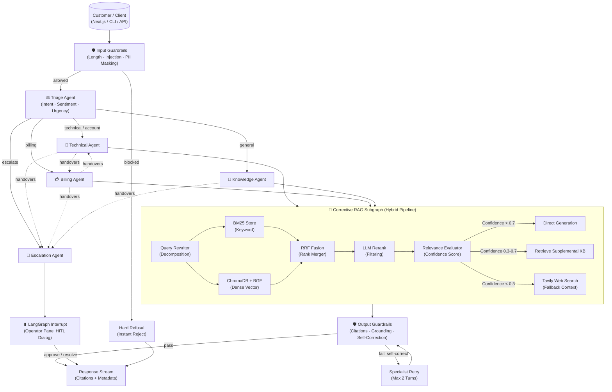

# ☁️ CloudDash AI Support Engine

[](https://www.python.org/)
[](https://github.com/langchain-ai/langgraph)
[](https://fastapi.tiangolo.com/)
[](file:///Users/mohanganesh/assignment/LICENSE)

An enterprise-grade, multi-agent AI customer support system built for **CloudDash**—a fictional cloud infrastructure monitoring platform. The system handles complex, multi-turn technical and billing queries, coordinates agent handovers with structured state tracking, performs semantic retrieval with query rewriting, enforces strict input/output guardrails, and provides human-in-the-loop (HITL) escalation capabilities.

---

### 🟢 Production Deployments

| Component | Platform | Live URL |
|---|---|---|
| **Operator Dashboard (Next.js)** | Vercel | [frontend-ten-gray-22.vercel.app](https://frontend-ten-gray-22.vercel.app/) |
| **REST API Server (FastAPI)** | Render | [clouddash-hev5.onrender.com](https://clouddash-hev5.onrender.com) |
| **API Health Check** | Render | [clouddash-hev5.onrender.com/api/health](https://clouddash-hev5.onrender.com/api/health) |
| **Interactive OpenAPI Docs** | Render | [clouddash-hev5.onrender.com/docs](https://clouddash-hev5.onrender.com/docs) |

---

## 🛠️ Architecture Blueprint



---

## 💡 Architectural Highlights

### 1. Dynamic Agent Registry (`config/agents.yaml`)
Specialized agents are not hardcoded. The system compiles its LangGraph `StateGraph` dynamically at startup using `AgentRegistry`. Adding a new agent requires zero core orchestration code changes:
* Add a configuration block to `config/agents.yaml`.
* Implement the class extending `BaseAgent`.
* The orchestrator dynamically builds nodes and conditional routing edges automatically.

### 2. Primary Reasoning Engine: Sarvam AI (`sarvam-105b`)
The primary model powering all specialists, evaluations, and triage routing is **Sarvam AI** (`sarvam-105b`) running with `reasoning_effort: high`.
* **Multilingual Input Node**: Detects regional Indian languages (Hindi, Tamil, Telugu, etc.) at turn 1, injects a localized greeting, and dynamically coordinates responses.
* **Structured Outputs**: Fully schemas-validated using Pydantic bindings directly compiled through the ChatOpenAI client.
* **Adaptive Fallback Chain**: In case of transient rate-limits, the system falls back gracefully: `Sarvam AI` ➔ `Google Gemini` ➔ `Groq Llama-3`.

### 3. Corrective RAG Subgraph (CRAG)
Retrieval is implemented as a first-class nested LangGraph state machine:
* **Hybrid Retrieval**: Executes dense vector search (ChromaDB + `BAAI/bge-small-en-v1.5`) and lexical keyword search (BM25) in parallel.
* **RRF Rank Fusion**: Combines ranks using Reciprocal Rank Fusion ($k=60$).
* **LLM Reranker**: Employs `sarvam-105b` to evaluate semantic compatibility, returning top matches with reasoning justifications.
* **Triple-Path Branching**:
  * **Direct**: Grounded output utilizing highly relevant articles.
  * **Supplemental**: Expands query intent to fetch peripheral overview documents when context is partially missing.
  * **Web Fallback**: Triggers Tavily API searches for out-of-domain terms (e.g., Datadog integration queries).

### 4. 2-Layer Guardrails & Self-Correction
* **Input Checks**: Block messages exceeding length limitations (4000 characters), runs a structured LLM injection check, and redacts inbound PII (SSNs, credit cards, phones) using regex + contextual LLM classification.
* **Output Grounding**: Factual claims are analyzed against retrieved chunks. If ungrounded assertions are detected, the system triggers a self-correction prompt, instructing the agent to rewrite its reply based strictly on the KB.
* **Citation Validator**: Inspects all inline `[KB-XXX § N]` tags, verifying they correspond to retrieved chunks.

### 5. Stateful Memory & Human-in-the-Loop (HITL)
Uses `AsyncSqliteSaver` checkpointers to persist session states across async HTTP turns. For high-urgency escalations, the graph calls `interrupt()`, saving the active state and pausing execution. The dashboard presents the operator with a resolution panel; once resolved, the graph resumes statefully using `Command(resume=...)`.

---

## 📂 Repository Layout

```
.
├── DESIGN.md                  # 15 Architecture Decision Records (ADRs)
├── PROGRESS.md                # Chronological build log and engineering process
├── EVAL_RESULTS.md            # LLM-as-a-judge metric scores for all test runs
├── REQUIREMENTS_MATRIX.md     # Rubric requirements mapped to implementation
├── Makefile                   # Shortcuts (install, test, run, demo)
├── pyproject.toml             # Backend dependencies and metadata config
├── requirements.txt           # Unified dependency lists
├── render.yaml                # Render service orchestration blueprint
│
├── config/                    # Orchestrator Configuration
│   ├── agents.yaml            # YAML declaration of active agents
│   └── routing.yaml           # Intent-to-agent mapping definitions
│
├── knowledge_base/            # 19 Markdown articles across 5 domains
│   ├── account_access/        # SSO configurations, Okta, AzureAD, RBAC
│   ├── api_docs/              # Webhooks, Python SDK, Rate Limits
│   ├── billing/               # Plan upgrades, Refund Policy, Invoice formats
│   ├── faqs/                  # Cloud support matrix, reset protocols
│   └── troubleshooting/       # AWS rotations, alerts failing, latency
│
├── backend/                   # Production Core Service
│   ├── src/clouddash/
│   │   ├── agents/            # BaseAgent class and specialist files
│   │   ├── retrieval/         # CRAG subgraph, BM25, Chroma vectors, reranking
│   │   ├── guardrails/        # Pre-LLM, Post-LLM, and Self-correction loop
│   │   ├── orchestrator/      # StateGraph assembly & SSE streaming endpoints
│   │   ├── tools/             # Mock CRM lookups & tickets generator
│   │   ├── providers/         # ChatOpenAI factories & Sarvam adapters
│   │   └── api/               # FastAPI routing, endpoints, and health checks
│
└── frontend/                  # Next.js Operator Dashboard
    ├── components/            # Chat stream, node trace timeline, HITL modals
    ├── hooks/                 # Server-Sent Events (SSE) parsing stream
    └── store/                 # Zustand global client conversation store
```

---

## ⚡ Quick Start (Local Setup)

### 1. Set Up Virtual Environment
```bash
git clone https://github.com/mohanganesh3/clouddash.git
cd clouddash

# Create virtual environment
python3 -m venv .venv
source .venv/bin/activate

# Install runtime + development dependencies
pip install -e ".[dev]"
```

### 2. Configure Environment Variables
Create a `.env` file at the repository root:
```env
APP_ENV=development
LLM_PROVIDER=sarvam
SARVAM_API_KEY=your-sarvam-key-here
COHERE_API_KEY=your-cohere-key-here     # Optional: falls back to LLM reranking
TAVILY_API_KEY=your-tavily-key-here     # Optional: falls back to KB defaults
LANGCHAIN_API_KEY=your-langsmith-key    # Optional: for tracing
LANGCHAIN_TRACING_V2=false
```

### 3. Ingest the Knowledge Base
Parse and embed the 19 markdown articles into ChromaDB:
```bash
python -m clouddash.scripts.ingest_kb
```
*Note: Ingests 19 articles, compiling ~147 chunks with contextual prefixes in `backend/data/chroma`.*

### 4. Run the API Server
```bash
# Start FastAPI backend (port 8000)
clouddash serve --port 8000
```

### 5. Run the Frontend Dashboard
In a separate terminal tab:
```bash
cd frontend
npm install
npm run dev
```
Open `http://localhost:3000` to interact with the Next.js visual operator dashboard.

---

## 🎯 Verification & Evaluation

### Automatic Scenario Demo
To run the 4 official scenarios from the rubric sequentially in the CLI and view their outputs:
```bash
make demo-scenario-1
make demo-scenario-2
make demo-scenario-3
make demo-scenario-4
```

### Evals Suite
The evaluation suite runs LLM-as-a-judge tests across all 8 rubric scenarios (measuring routing accuracy, citation validity, and hallucination refusals):
```bash
python -m clouddash.evals.run --output EVAL_RESULTS.md
```
*Current test metrics achieve a **100% Pass Rate (8/8)**. See [`EVAL_RESULTS.md`](EVAL_RESULTS.md) for full transcripts.*

---

## 📝 CLI & API Reference

### CLI Utilities
| Command | Action |
|---|---|
| `clouddash ingest` | Clears and embeds the Knowledge Base |
| `clouddash Serve` | Launches FastAPI backend (supports standard and SSE streams) |
| `clouddash chat` | Interactive local REPL terminal chat |
| `clouddash agents` | Lists loaded specialists from YAML registry |
| `clouddash health` | Evaluates environment configurations and API keys |

### API Endpoints
* **`POST /api/chat`**: Primary endpoint. Initiates/continues a support thread. Supports standard returns or `text/event-stream` SSE tokens.
* **`GET /api/health`**: Diagnostic system config check.
* **`GET /api/conversations/{id}`**: Returns state logs and thread message history.
* **`GET /api/trace/{id}`**: Resolves all JSONL audit events for a session.

---

## 🚀 Live Demo: Adding a New Agent in 60 Seconds
The System Design is built for zero-dependency scaling. To add a new agent:

1. Add the configuration to `backend/config/agents.yaml`:
   ```yaml
   onboarding:
     class: clouddash.agents.onboarding.OnboardingAgent
     system_prompt: onboarding
     model_tier: reasoning
     tools: []
     requires_kb: true
     description: Helps new customers provision accounts.
   ```
2. Create the prompt template in `backend/src/clouddash/prompts/onboarding.md`.
3. Create `backend/src/clouddash/agents/onboarding.py`:
   ```python
   from clouddash.agents.base import BaseAgent
   from clouddash.models import AgentResponse

   class OnboardingAgent(BaseAgent):
       async def handle(self, state):
           # Custom routing/handling logic here
           return AgentResponse(...)
   ```
4. Restart the API server or click **Reload Registry** in the UI. Triage will automatically route onboarding queries to the new node.

---

## 📜 Architectural Decisions (ADR Summary)
Detailed records of design tradeoffs can be found in [`DESIGN.md`](DESIGN.md):

* **ADR-001**: Orchestrator-Worker pattern utilizing LangGraph for structured transitions.
* **ADR-002**: First-class typed `HandoverPacket` contract models.
* **ADR-003**: Hybrid RAG pipeline with LLM-based reranking and inline citations.
* **ADR-004**: YAML-driven dynamic agent registry pattern.
* **ADR-005**: 2-layer guardrails with self-correction feedback loop.
* **ADR-006**: Dual observability using LangSmith + local JSONL audit tracing.
* **ADR-007**: LLM-as-a-judge automated scenario grader.
* **ADR-008**: Stateless blueprinting on Render free tier.
* **ADR-009**: Provider configurations favoring Sarvam AI reasoning.
* **ADR-010**: Real-time SSE token-by-token client rendering.
* **ADR-011**: Standalone retrieval subgraph separation.
* **ADR-012**: Fallback chain leveraging openai compatible ChatOpenAI wrapper.
* **ADR-013**: Graph state serialization optimization.
* **ADR-014**: Next.js 15 client dashboard interface.
* **ADR-015**: Localization support using Sarvam API translator.
