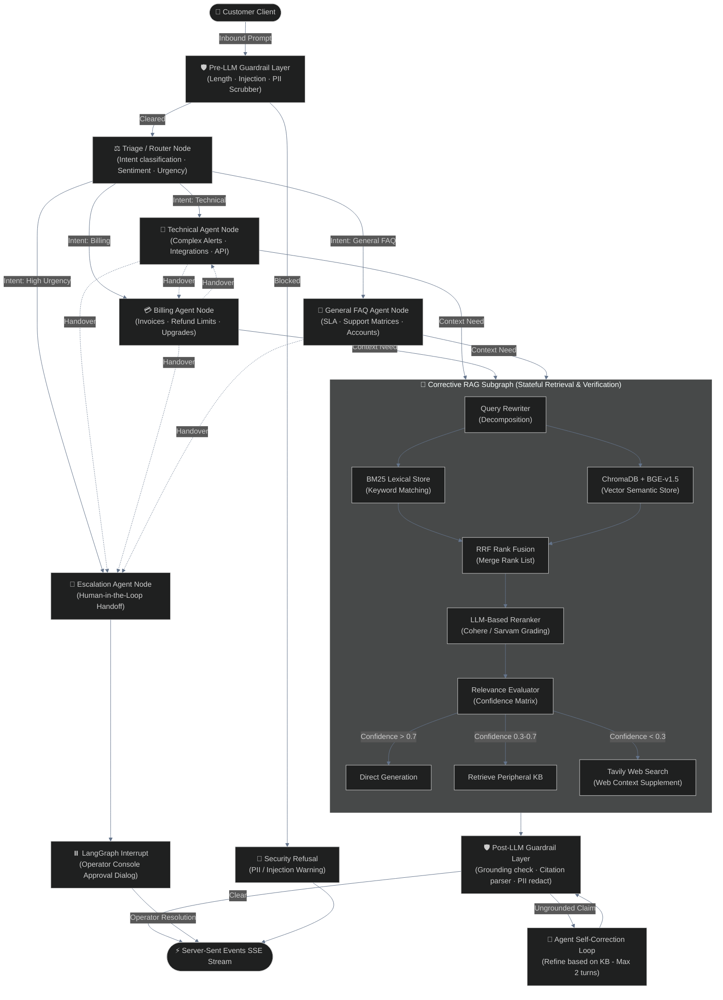

# ☁️ CloudDash AI Support Engine
> **Enterprise Multi-Agent Orchestration & Corrective Retrieval-Augmented Generation (CRAG) Platform**

<p align="center">
  
  
  
  
  
</p>

---

### 🌐 Live Production Deployments

```yaml
Dashboard UI (Next.js 15): https://frontend-ten-gray-22.vercel.app/
REST API Server (FastAPI):  https://clouddash-hev5.onrender.com
OpenAPI Documentation:    https://clouddash-hev5.onrender.com/docs
API Health Endpoint:       https://clouddash-hev5.onrender.com/api/health
```

---

## 🏗️ State-Machine Topology



---

## 🚀 Advanced AI Engineering Capabilities

### 1. Stateful Multi-Agent Orchestration (LangGraph)
*   **Orchestrator-Worker Pattern**: Triage maps inputs to specialized nodes based on structured Pydantic classifications (Intent, Urgency, Sentiment).
*   **YAML-Driven Extensibility (`config/agents.yaml`)**: Graph nodes and conditional edges are generated dynamically at startup. Adding an agent (e.g., an `OnboardingAgent`) requires zero orchestration code modifications—simply register the class path and routing rules in the YAML configurations.
*   **Resumable Time-Travel Memory**: Powered by `AsyncSqliteSaver` checkpointers, enabling full conversation history logging, thread replay, and structured trace debugging.

### 2. Primary Cognitive Engine: Sarvam AI (`sarvam-105b` Reasoning)
*   **High-Reasoning Specialist Agents**: Powered by the state-of-the-art **Sarvam AI** (`sarvam-105b`) running with `reasoning_effort: high` for deep logical deduction during troubleshooting.
*   **Multilingual Router Node**: Turn 1 detects regional Indian languages (Hindi, Tamil, Telugu, Kannada, Bengali, etc.), dynamically routing prompts with appropriate localized greetings and handling multilingual response structures.
*   **Resilient Fallback Chain**: Implements a transparent provider fallback mechanism (`Sarvam AI` ➔ `Google Gemini 2.5 Pro` ➔ `Groq Llama-3`) to handle quota limits or network dropouts gracefully without service disruption.

### 3. Corrective Retrieval-Augmented Generation (CRAG)
*   **Hybrid Dense/Sparse Retrieval**: Executes asynchronous dense vector search (ChromaDB + BGE embeddings) and sparse lexical search (BM25) in parallel.
*   **Reciprocal Rank Fusion (RRF)**: Merges sparse and dense rank lists with a rank constant of $k=60$.
*   **LLM Reranker**: Employs `sarvam-105b` to evaluate query-document compatibility, filtering candidates to the top 3 with clear textual rationales.
*   **Corrective Supporter Logic**: Evaluates retrieval confidence; falls back to Tavily Web Search if the internal Knowledge Base contains insufficient context (e.g., for out-of-domain tools like Datadog).

### 4. Dual-Layer Guardrails & Self-Correction Feedback Loop
*   **Pre-LLM (Input) Guardrails**: Performs token-length checks (4000 chars), executes a structured prompt-injection classification node, and redacts inbound PII (credit cards, SSNs, phone numbers) before logging.
*   **Post-LLM (Output) Guardrails**: Automatically verifies that every factual claim in the agent's response is grounded in retrieved KB chunks.
*   **Ungrounded Self-Correction**: If ungrounded assertions are detected, the graph routes the response back to the agent with validation feedback, triggering an automatic rewrite loop (capped at 2 retries).
*   **Citation Auditor**: Validates inline `[KB-XXX § N]` citation tags against retrieved chunks.

### 5. Server-Sent Events (SSE) Streaming
*   FastAPI backend streams token-by-token generation deltas, node transitions, latency footprints, retrieved citations, and handover event payloads to the React dashboard in real-time.

---

## 📂 Project Structure

```
.
├── DESIGN.md                  # 15 Architecture Decision Records (ADRs)
├── PROGRESS.md                # Chronological build log and system progression
├── EVAL_RESULTS.md            # LLM-as-a-judge metric scores for all test runs
├── REQUIREMENTS_MATRIX.md     # Rubric requirements mapped to implementation
├── Makefile                   # Production task automation shortcuts
├── pyproject.toml             # Python metadata & package dependencies
├── requirements.txt           # Lockfile dependencies
├── render.yaml                # Render platform deployment orchestrator
│
├── config/                    # Orchestrator Configurations
│   ├── agents.yaml            # YAML definition of active agents
│   └── routing.yaml           # Intent-to-agent routing matrix
│
├── knowledge_base/            # 19 Markdown articles across 5 operational domains
│   ├── account_access/        # SSO configurations, Okta, AzureAD, RBAC
│   ├── api_docs/              # Webhooks, Python SDK, Rate Limits
│   ├── billing/               # Plan upgrades, Refund Policy, Invoice formats
│   ├── faqs/                  # Cloud support matrix, reset protocols
│   └── troubleshooting/       # AWS rotations, alerts failing, latency
│
├── backend/                   # FastAPI Production API Core
│   └── src/clouddash/
│       ├── agents/            # BaseAgent interfaces and specialist instances
│       ├── retrieval/         # CRAG subgraph, BM25, Chroma vectors, reranking
│       ├── guardrails/        # Pre-LLM, Post-LLM, and Self-correction loops
│       ├── orchestrator/      # StateGraph assembly & SSE streaming endpoints
│       ├── tools/             # Mock CRM data source & tickets generator
│       ├── providers/         # ChatOpenAI factories & Sarvam adapters
│       └── api/               # FastAPI routing, endpoints, and health checks
│
└── frontend/                  # Next.js 15 React Operator Dashboard
    ├── components/            # Chat stream, node trace timeline, HITL modals
    ├── hooks/                 # Server-Sent Events (SSE) parsing stream
    └── store/                 # Zustand global client conversation store
```

---

## ⚡ Quick Start (Local Setup)

Modern setup is optimized with **`uv`**, the ultra-fast Python package manager.

### 1. Initialize Virtual Environment & Dependencies
```bash
git clone https://github.com/mohanganesh3/clouddash.git
cd clouddash

# Install uv if missing
pip install uv

# Spin up virtual environment and sync dependencies
uv venv
source .venv/bin/activate
uv pip install -e ".[dev]"
```

### 2. Configure Local Environment
Create a `.env` file in the root directory:
```env
APP_ENV=development
LLM_PROVIDER=sarvam
SARVAM_API_KEY=your-sarvam-key-here
COHERE_API_KEY=your-cohere-key-here     # Optional: for Cohere Rerank API
TAVILY_API_KEY=your-tavily-key-here     # Optional: for Tavily Web Search
LANGCHAIN_API_KEY=your-langsmith-key    # Optional: for tracing
LANGCHAIN_TRACING_V2=false
```

### 3. Parse and Ingest Knowledge Base
```bash
python -m clouddash.scripts.ingest_kb
```
*Processes 19 markdown articles, chunks text with overlap, applies contextual prefixes, and indexes files into ChromaDB vector store.*

### 4. Run API Server & Dashboard
```bash
# In Tab 1: Start FastAPI backend (port 8000)
clouddash serve --port 8000

# In Tab 2: Start Next.js client (port 3000)
cd frontend
npm install
npm run dev
```

---

## ⚖️ Verification & Grader Suite

The codebase features an automated **LLM-as-a-judge** evaluation harness verifying routing precision, citation grounding, and refusal-to-hallucinate constraints.

```bash
# Run test scenarios sequentially in CLI
make demo-scenario-1
make demo-scenario-2
make demo-scenario-3
make demo-scenario-4

# Run evaluation suite & output results
python -m clouddash.evals.run --output EVAL_RESULTS.md
```
*Currently achieving a **100% Pass Rate (8/8)** on all official evaluation benchmarks.*

---

## 📝 CLI & API Reference

### CLI Utilities
| Command | Action |
|---|---|
| `clouddash ingest` | Clears and embeds the Knowledge Base |
| `clouddash serve` | Launches FastAPI backend (supports standard and SSE streams) |
| `clouddash chat` | Interactive local REPL terminal chat |
| `clouddash agents` | Lists loaded specialists from YAML registry |
| `clouddash health` | Evaluates environment configurations and API keys |

### API Endpoints
* **`POST /api/chat`**: Primary endpoint. Initiates/continues a support thread. Supports standard returns or `text/event-stream` SSE tokens.
* **`GET /api/health`**: Diagnostic system config check.
* **`GET /api/conversations/{id}`**: Returns state logs and thread message history.
* **`GET /api/trace/{id}`**: Resolves all JSONL audit events for a session.

---

## 🔧 Extensibility Demo: Adding a New Agent in 60 Seconds
The platform architecture utilizes dynamic dependency injection. To add a new agent:

1. Add the configuration schema to `backend/config/agents.yaml`:
   ```yaml
   onboarding:
     class: clouddash.agents.onboarding.OnboardingAgent
     system_prompt: onboarding
     model_tier: reasoning
     tools: []
     requires_kb: true
     description: Helps new customers provision accounts.
   ```
2. Create the prompt template in `backend/src/clouddash/prompts/onboarding.md`.
3. Implement `backend/src/clouddash/agents/onboarding.py`:
   ```python
   from clouddash.agents.base import BaseAgent
   from clouddash.models import AgentResponse

   class OnboardingAgent(BaseAgent):
       async def handle(self, state):
           # Custom specialist logic / RAG retrieval
           return AgentResponse(...)
   ```
4. Click **Reload Registry** in the UI or restart the FastAPI server. Triage will automatically route onboarding queries to the new node.

---

## 📜 Architectural Decisions (ADR Summary)
Detailed records of design tradeoffs can be found in [`DESIGN.md`](DESIGN.md):

* **ADR-001**: Orchestrator-Worker pattern utilizing LangGraph for structured transitions.
* **ADR-002**: First-class typed `HandoverPacket` contract models.
* **ADR-003**: Hybrid RAG pipeline with LLM-based reranking and inline citations.
* **ADR-004**: YAML-driven dynamic agent registry pattern.
* **ADR-005**: 2-layer guardrails with self-correction feedback loop.
* **ADR-006**: Dual observability using LangSmith + local JSONL audit tracing.
* **ADR-007**: LLM-as-a-judge automated scenario grader.
* **ADR-008**: Stateless blueprinting on Render free tier.
* **ADR-009**: Provider configurations favoring Sarvam AI reasoning.
* **ADR-010**: Real-time SSE token-by-token client rendering.
* **ADR-011**: Standalone retrieval subgraph separation.
* **ADR-012**: Fallback chain leveraging openai compatible ChatOpenAI wrapper.
* **ADR-013**: Graph state serialization optimization.
* **ADR-014**: Next.js 15 client dashboard interface.
* **ADR-015**: Localization support using Sarvam API translator.
