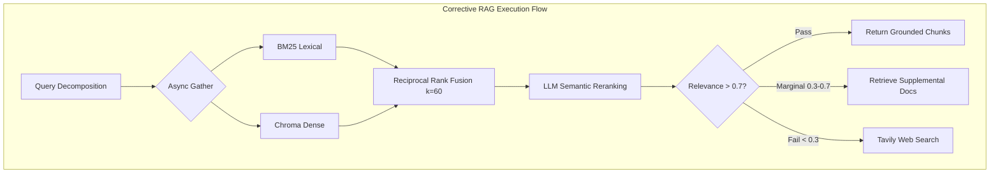

# CloudDash AI Customer Support Orchestrator

[](https://www.python.org/downloads/)
[](https://github.com/langchain-ai/langgraph)
[](https://fastapi.tiangolo.com/)
[](https://opensource.org/licenses/MIT)

CloudDash is an enterprise-grade, multi-agent AI support system built on an orchestrator-worker graph topology. It handles complex technical and billing queries, coordinates agent handovers with strict state tracking, performs Corrective Retrieval-Augmented Generation (CRAG), and supports Human-in-the-loop (HITL) execution pauses.

This repository serves as the reference implementation for the AI Engineering Intern assessment.

---

## 1. Architecture Overview (C4 Model)

The system utilizes an orchestrator-worker pattern, natively implemented as a `StateGraph` in LangGraph. State persistence is handled via asynchronous SQLite checkpointers, enabling true interruptibility and cross-session memory.

### 1.1 Container Architecture

```mermaid
C4Container
    title System Container Architecture

    Person(customer, "Customer", "Interacts via chat dashboard or API.")
    Person(operator, "Human Operator", "Monitors escalations and resolves HITL interrupts.")

    System_Boundary(c1, "CloudDash AI Engine") {
        Container(api, "FastAPI Service", "Python", "Exposes REST and SSE endpoints for streaming state.")
        Container(triage, "Triage Orchestrator", "LangGraph Node", "Classifies intent, sentiment, and urgency.")
        
        Container_Boundary(workers, "Specialist Workers") {
            Container(tech, "Technical Agent", "Node", "Handles AWS, SDK, and infrastructure queries.")
            Container(billing, "Billing Agent", "Node", "Handles invoices, refunds, and upgrades.")
            Container(escalate, "Escalation Agent", "Node", "Pauses execution (HITL) for human intervention.")
        }
        
        Container_Boundary(crag, "CRAG Subgraph") {
            ContainerDb(chroma, "ChromaDB", "Vector", "Dense embeddings store (BGE-Small).")
            ContainerDb(bm25, "BM25 Store", "Lexical", "Keyword frequency store.")
            Container(fusion, "Rank Fusion & Rerank", "LLM", "RRF + LLM semantic filtering.")
        }
        
        ContainerDb(sqlite, "State Checkpointer", "SQLite", "Persists HandoverPackets and conversation history.")
    }

    Rel(customer, api, "Sends queries", "JSON/REST")
    Rel(operator, api, "Approves escalations", "JSON/REST")
    Rel(api, triage, "Invokes graph")
    Rel(triage, workers, "Routes based on IntentClassification schema")
    Rel(workers, crag, "Queries KB", "Internal Async")
    Rel(crag, chroma, "Dense Search")
    Rel(crag, bm25, "Lexical Search")
    Rel(workers, sqlite, "Checkpoints state on node exit")
    Rel(escalate, operator, "Triggers LangGraph interrupt()")
```

### 1.2 Subgraph: Corrective Retrieval (CRAG) Data Flow

To mitigate hallucinations, retrieval is decoupled into a standalone LangGraph subgraph that validates context before generation.



---

## 2. Core Engineering Decisions

Every major architectural choice is documented strictly in `DESIGN.md`. A summary of critical implementation details:

* **Inference Engine (`sarvam-105b`)**: Optimized for high reasoning effort. Provides structured Pydantic outputs natively and executes native language detection for localization (ADR-009, ADR-015).
* **Zero-Code Agent Registry**: New specialist agents are added via `config/agents.yaml`. The orchestrator dynamically builds the `StateGraph` and conditional routing edges at runtime using `importlib`, decoupling routing logic from agent definitions (ADR-004).
* **Strict Data Contracts (`HandoverPacket`)**: Agent-to-agent transitions pass typed Pydantic models carrying trace IDs, extracted entities, and confidence scores, replacing loose textual handovers (ADR-002).
* **Layered Guardrails & Self-Correction**: 
  1. *Pre-LLM*: Regex PII redaction and prompt-injection detection.
  2. *Post-LLM*: The output validator forces a structural verification of all `[KB-XXX § N]` citations against the retrieved chunks. Violations trigger an internal self-correction loop before streaming to the client (ADR-005).
* **Server-Sent Events (SSE)**: State transitions, tool invocations, and token generation are streamed to the client in real-time, matching modern GenAI UX expectations (ADR-010).

---

## 3. Local Deployment & Usage

### 3.1 Environment Configuration

```bash
git clone https://github.com/mohanganesh3/clouddash.git
cd clouddash

python3 -m venv .venv
source .venv/bin/activate
pip install -e ".[dev]"
```

Create a `.env` file at the root:
```ini
APP_ENV=development
LLM_PROVIDER=sarvam
SARVAM_API_KEY=your_key_here
```

### 3.2 Initialization & Execution

1. **Ingest the Knowledge Base**: Parses markdown files, applies contextual chunking, and populates the local ChromaDB and BM25 stores.
   ```bash
   clouddash ingest
   ```
2. **Start the API Server**: Launches the FastAPI instance (port 8000).
   ```bash
   clouddash serve --port 8000
   ```
3. **Run Evaluation Suite**: Executes the LLM-as-a-judge automated benchmarking pipeline against the 8 required operational scenarios.
   ```bash
   python -m clouddash.evals.run --output EVAL_RESULTS.md
   ```

---

## 4. Operational Endpoints

The API is fully documented via OpenAPI. By default, Swagger UI is available at `/docs`.

| Method | Endpoint | Description |
| :--- | :--- | :--- |
| `POST` | `/api/chat` | Main interaction endpoint. Supports `text/event-stream` for SSE token/state streaming. |
| `GET`  | `/api/health` | Validates provider connectivity, DB read access, and API key configurations. |
| `GET`  | `/api/trace/{id}` | Returns structured JSONL audit logs for a specific conversation UUID. |

---

## 5. Live Production Topology

The infrastructure is deployed statelessly using Render for the backend and Vercel for the Next.js operator panel.

* **Frontend Dashboard**: [frontend-ten-gray-22.vercel.app](https://frontend-ten-gray-22.vercel.app/)
* **Backend API**: [clouddash-hev5.onrender.com](https://clouddash-hev5.onrender.com)
* **API Documentation**: [clouddash-hev5.onrender.com/docs](https://clouddash-hev5.onrender.com/docs)
