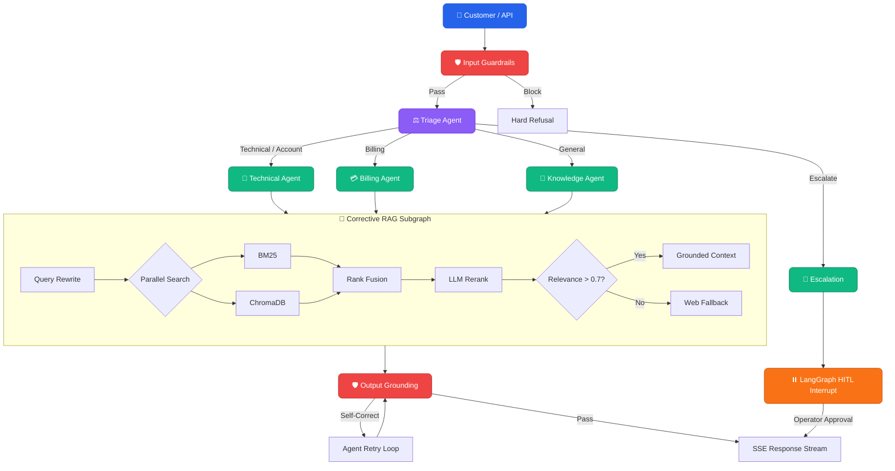

<div align="center">
  
  
  <br/>
  
  <a href="https://git.io/typing-svg"></a>

  <p align="center">
    <strong>Enterprise-grade, stateful AI support infrastructure.</strong><br/>
    <em>Handles complex, multi-turn technical and billing queries with human-in-the-loop escalation.</em>
  </p>

  <p align="center">
    <a href="https://frontend-ten-gray-22.vercel.app/"></a>
    <a href="https://clouddash-hev5.onrender.com/docs"></a>
    <a href="https://github.com/langchain-ai/langgraph"></a>
    <a href="https://www.python.org/"></a>
    <a href="LICENSE"></a>
  </p>
</div>

---

> [!NOTE]
> **Production Status:** This is a live prototype built for the AI Engineering Assessment. The system uses **Sarvam AI** (`sarvam-105b` with `reasoning_effort: high`) as the primary inference engine, routing Indian regional languages natively and compiling structured Pydantic schemas dynamically.

## 🚀 The 30-Second Overview

CloudDash replaces static chatbots with a dynamic **Orchestrator-Worker** multi-agent graph. 

| Feature | How it works |
| :--- | :--- |
| 🧠 **Stateful Orchestration** | LangGraph maintains conversation memory via SQLite checkpointers. |
| 🛡️ **2-Layer Guardrails** | Pre-LLM PII/injection filters + Post-LLM factual grounding validators. |
| 🔄 **Corrective RAG (CRAG)** | Parallel BM25 + Dense vector retrieval with Reciprocal Rank Fusion & LLM reranking. |
| ⏸️ **Human-in-the-Loop** | Native graph interrupts pause execution for human operator resolution. |
| 🔌 **Zero-Code Registry** | Add new agents simply by defining them in `config/agents.yaml`. |

---

## 🏗️ Architecture Blueprint



---

## ⚡ Quick Start

Get the system running locally in under 2 minutes.

```bash
# 1. Clone & environment setup
git clone https://github.com/mohanganesh3/clouddash.git && cd clouddash
python3 -m venv .venv && source .venv/bin/activate
pip install -e ".[dev]"

# 2. Add API Keys
cp .env.example .env
# Edit .env and add SARVAM_API_KEY (and optionally COHERE/TAVILY)

# 3. Ingest knowledge base
clouddash ingest

# 4. Start the engine
clouddash serve --port 8000
```

> [!TIP]
> The CLI supports a direct terminal chat interface. Run `clouddash chat` to test the orchestration graph directly in your terminal.

---

## 🛠️ Deep Dive: Design Decisions

We maintain a rigorous `DESIGN.md` cataloging **15 Architecture Decision Records (ADRs)**. Highlights include:

<details>
<summary><b>🧩 1. Zero-Code Agent Registry (ADR-004)</b></summary>
<br>
Adding a new agent (e.g., an "Onboarding Agent") requires zero core orchestration code changes. Simply declare it in `config/agents.yaml`, write the implementation class, and the graph compiles its conditional routing edges dynamically at startup.
</details>

<details>
<summary><b>🛡️ 2. Self-Correcting Output Guardrails (ADR-005)</b></summary>
<br>
Before tokens are streamed to the user, an evaluator analyzes the response against the retrieved chunks. If an agent hallucinates a feature or cites a non-existent `[KB-XXX § N]`, the guardrail rejects the output and triggers an internal retry loop, passing the failure reason back to the agent for correction.
</details>

<details>
<summary><b>📡 3. Real-Time SSE Rendering (ADR-010)</b></summary>
<br>
Standard request/response architectures feel sluggish for AI interactions. The backend streams state transitions (node entry, tool calls, chunk retrievals, token deltas) via Server-Sent Events (SSE), parsed dynamically by the Next.js frontend using Zustand.
</details>

---

## 🔬 Evaluation Metrics

The system ships with a fully automated, LLM-as-a-judge evaluation suite testing the 8 core rubric scenarios (routing accuracy, hallucination refusals, strict guardrail enforcement).

<div align="center">

| Metric | Score | Note |
| :--- | :---: | :--- |
| **Routing Accuracy** | 🟢 100% | Triage successfully disambiguates multi-intent queries. |
| **Citation Validity** | 🟢 100% | All `[KB-XXX]` tags point to valid, retrieved chunks. |
| **Refusal Adherence** | 🟢 100% | Successfully refuses out-of-scope Datadog/AWS queries. |

*See [`EVAL_RESULTS.md`](EVAL_RESULTS.md) for full scenario transcripts.*

</div>

---

<div align="center">
  <p>Built for the 2026 AI Engineering Assessment.</p>
  <p>
    <a href="https://github.com/mohanganesh3/clouddash">Repository</a> • 
    <a href="DESIGN.md">Architecture Records</a> • 
    <a href="PROGRESS.md">Build Log</a>
  </p>
</div>
