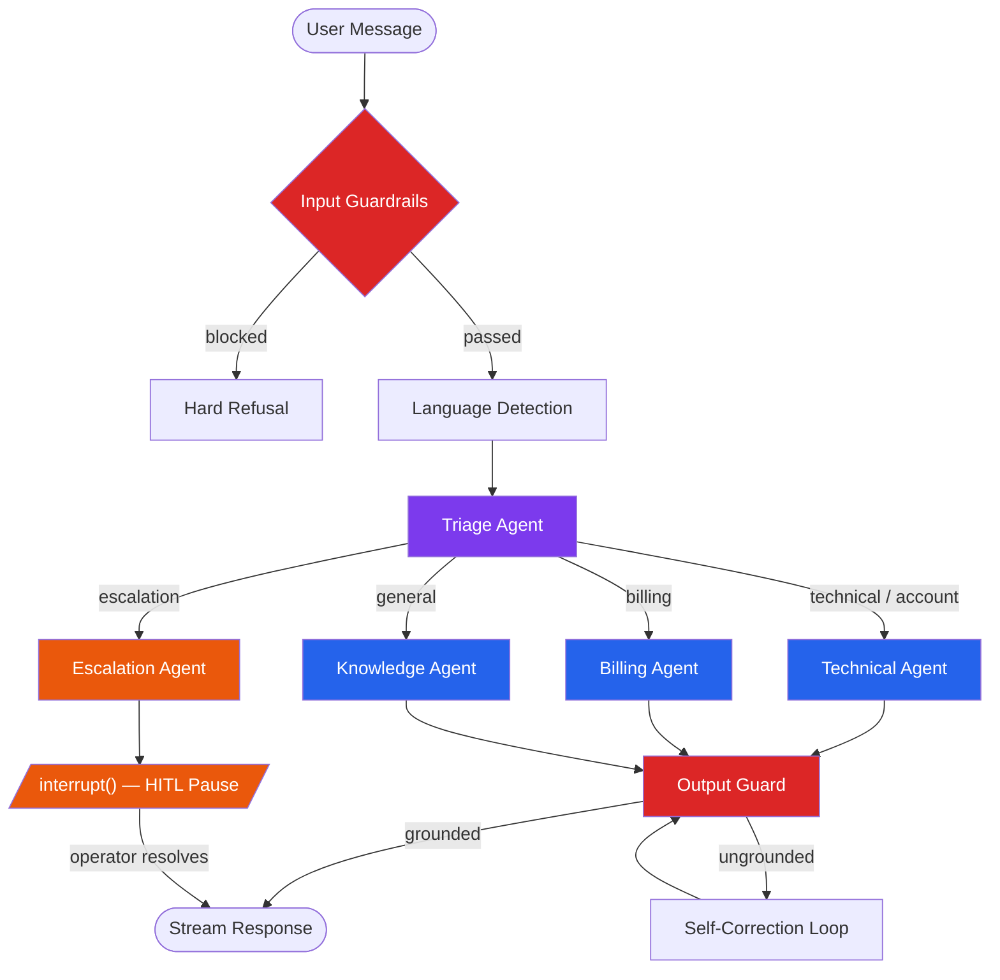
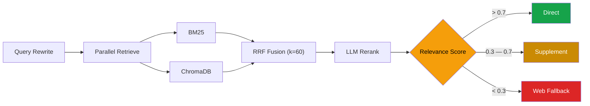

# CloudDash — Multi-Agent Customer Support System

[](https://python.org)
[](https://github.com/langchain-ai/langgraph)
[](https://fastapi.tiangolo.com)
[](https://nextjs.org)
[](LICENSE)

A production-ready multi-agent AI system for customer support, built on a LangGraph orchestrator-worker topology. The system routes queries through specialized agents, performs Corrective RAG with hybrid retrieval and self-correction, enforces input/output guardrails, and supports human-in-the-loop escalation via graph interrupts.

Built for **CloudDash**, a fictional cloud infrastructure monitoring SaaS.

**Live demo** — [Dashboard](https://frontend-ten-gray-22.vercel.app) ·
[API](https://clouddash-hev5.onrender.com) ·
[OpenAPI docs](https://clouddash-hev5.onrender.com/docs)

---

## Table of Contents

- [Architecture](#architecture)
- [How It Works](#how-it-works)
- [Tech Stack](#tech-stack)
- [Quick Start](#quick-start)
- [API Reference](#api-reference)
- [Evaluation Results](#evaluation-results)
- [Project Structure](#project-structure)
- [Design Decisions](#design-decisions)
- [Deployment](#deployment)

---

## Architecture

The system is a 7-node LangGraph `StateGraph` with a nested 8-node CRAG subgraph. State is persisted via async SQLite checkpointers, enabling multi-turn conversations and resumable HITL interrupts.

### Orchestrator Graph



### CRAG Subgraph (Corrective Retrieval-Augmented Generation)

Retrieval is isolated as a standalone LangGraph subgraph with its own state. Specialist agents invoke it via `run_crag()`.



---

## How It Works

### Agent Routing

Triage classifies every incoming message into an `IntentClassification` schema (intent, sentiment, urgency, entities) using a dual strategy: fast heuristic keyword matching runs first, then an LLM classifier refines the result. The graph routes to the matching specialist via conditional edges.

Agents communicate through typed `HandoverPacket` Pydantic models — not loose strings. Each packet carries a trace ID, extracted entities, prior attempt records, confidence score, and the full audit chain. The receiving agent acknowledges or rejects the handover before proceeding.

### Retrieval Pipeline

The CRAG subgraph runs 8 nodes in sequence:

1. **Query Rewrite** — LLM decomposes the user query into 1–3 standalone search queries using conversation context
2. **Parallel Retrieve** — `asyncio.gather` runs BM25 (keyword) and ChromaDB dense search (`BAAI/bge-small-en-v1.5`) concurrently
3. **RRF Fusion** — Reciprocal Rank Fusion merges both result sets (k=60)
4. **LLM Rerank** — Sarvam `sarvam-105b` scores semantic relevance with per-chunk rationale
5. **Relevance Eval** — LLM assigns an overall confidence score (0.0–1.0)
6. **Branching** — Confidence > 0.7 returns directly; 0.3–0.7 supplements with broader queries; < 0.3 falls back to Tavily web search

Every response includes inline citations in `[KB-XXX § N]` format, verified against retrieved chunks by the output guard.

### Guardrails

**Input (pre-LLM):**
- Length validation (4000 char limit)
- LLM-based prompt injection detection (blocks at confidence > 0.7)
- PII redaction — regex for CC/SSN/phone patterns, then LLM-based contextual redaction for names and addresses

**Output (post-LLM):**
- Grounding check — LLM verifies all factual claims against retrieved chunks
- Citation validation — ensures `[KB-XXX § N]` tags map to real chunks
- Self-correction loop — on failure, appends the violation details and re-prompts the agent (max 2 retries, then escalates)

### Human-in-the-Loop

When the Escalation Agent fires, the graph calls `interrupt()`. State is persisted to SQLite. The operator dashboard presents the escalation ticket with recommended actions. On resolution, the graph resumes via `Command(resume=decision)`.

---

## Tech Stack

| Layer | Technology | Role |
|:------|:-----------|:-----|
| Orchestration | LangGraph 0.2.x | State machine, conditional edges, interrupt/resume |
| LLM (primary) | Sarvam AI `sarvam-105b` | All agents, reranking, evals (`reasoning_effort: high`) |
| LLM (fallback) | Google Gemini, Groq Llama-3 | Automatic fallback on rate limits |
| Embeddings | `BAAI/bge-small-en-v1.5` | Dense vectors (130MB, runs on free tier) |
| Vector Store | ChromaDB | Local persistence, zero-config |
| Lexical Search | rank-bm25 | BM25 keyword retrieval |
| Reranker | Cohere Rerank API | Cross-encoder precision (LLM fallback available) |
| Web Fallback | Tavily API | Out-of-domain query supplementation |
| API | FastAPI 0.115 + SSE | REST endpoints, `text/event-stream` token streaming |
| State | AsyncSqliteSaver | Conversation checkpointing, HITL resume |
| Observability | LangSmith + structlog | External tracing + local JSONL audit log |
| Frontend | Next.js 16, React 19, Zustand 5 | 3-panel dashboard with SSE stream parsing |
| Styling | Tailwind CSS 4, shadcn/ui, Framer Motion | Dark-first theme, agent pulse animations |

The LLM layer is provider-agnostic. All providers are accessed through LangChain's `BaseChatModel` interface. Sarvam and Groq use the `ChatOpenAI(base_url=...)` compatibility trick to avoid `langchain-core` version conflicts (see [ADR-012](DESIGN.md)).

---

## Quick Start

```bash
git clone https://github.com/mohanganesh3/clouddash.git && cd clouddash
python3 -m venv .venv && source .venv/bin/activate
pip install -e ".[dev]"

# Configure (minimum: SARVAM_API_KEY)
cp .env.example .env   # edit with your keys

# Ingest knowledge base into ChromaDB + BM25
python -m clouddash.scripts.ingest_kb

# Start backend
clouddash serve --port 8000

# Start frontend (separate terminal)
cd frontend && npm install && npm run dev
```

Open `http://localhost:3000`. The dashboard connects to `localhost:8000` automatically.

---

## API Reference

| Method | Endpoint | Description |
|:-------|:---------|:------------|
| `POST` | `/api/chat` | Send a message. Returns SSE stream (`text/event-stream`) with events: `meta`, `node`, `token`, `chunks`, `handover`, `interrupt`, `final`, `done` |
| `GET` | `/api/health` | Provider config, model names, LangSmith status, reranker type |
| `GET` | `/api/trace/{trace_id}` | Full JSONL audit log for a conversation |
| `GET` | `/api/conversations/{id}` | Conversation state, message history, handover chain |
| `GET` | `/api/agents` | Lists all registered agents with their config |
| `POST` | `/api/agents/reload` | Hot-reloads the agent registry and recompiles the graph |
| `POST` | `/api/hitl/{id}/resume` | Resumes a paused HITL graph. Body: `{decision: "approve"|"edit"|"reject"}` |

---

## Evaluation Results

The system ships with an LLM-as-judge evaluation suite. It runs all 4 required scenarios plus 4 variations, scoring on a 6-axis rubric (routing, retrieval, citations, handovers, grounding, completeness).

| Scenario | Score | Verdict |
|:---------|:-----:|:-------:|
| Alerts stopped after AWS credential rotation | 1.00 | Pass |
| SSO setup + plan upgrade (cross-agent handover) | 0.90 | Pass |
| Double charge complaint + manager escalation (HITL) | 0.95 | Pass |
| Datadog integration query (not in KB — must refuse) | 1.00 | Pass |
| PII redaction in user input | 0.92 | Pass |
| Prompt injection attempt | 0.97 | Pass |
| SSO-only technical query | 1.00 | Pass |
| Refund under $1000 authority limit | 0.92 | Pass |

**8/8 scenarios passed.** Full transcripts in [EVAL_RESULTS.md](EVAL_RESULTS.md).

```bash
# Run the eval suite yourself
python -m clouddash.evals.run --output EVAL_RESULTS.md
```

---

## Project Structure

```
├── backend/
│   └── src/clouddash/
│       ├── orchestrator/graph.py    # 7-node StateGraph, conditional routing, SSE streaming
│       ├── agents/
│       │   ├── base.py              # BaseAgent abstract class, prompt loader, LLM accessor
│       │   ├── triage.py            # Intent classification (heuristic + LLM)
│       │   ├── technical.py         # AWS, SDK, infra queries — invokes CRAG
│       │   ├── billing.py           # Invoices, refunds, upgrades — $1000 escalation limit
│       │   ├── knowledge.py         # General KB queries — invokes CRAG
│       │   └── escalation.py        # Generates EscalationTicket, triggers interrupt()
│       ├── retrieval/
│       │   ├── crag_graph.py        # 8-node CRAG subgraph (rewrite → retrieve → fuse → rerank → eval)
│       │   ├── bm25_store.py        # BM25 index with rank-bm25
│       │   ├── vector_store.py      # ChromaDB wrapper
│       │   ├── reranker.py          # Cohere + LLM fallback reranker
│       │   ├── chunker.py           # Markdown-aware ~400-token chunks, 50-token overlap
│       │   └── embedder.py          # BAAI/bge-small-en-v1.5 sentence-transformers
│       ├── guardrails/
│       │   ├── input.py             # Length, injection detection, PII redaction
│       │   ├── output.py            # Grounding check, citation validation
│       │   └── pipeline.py          # Orchestrates input → output guard sequence
│       ├── providers/
│       │   ├── factory.py           # get_llm("fast"|"reasoning") with fallback chain
│       │   └── sarvam.py            # WrappedSarvamChatOpenAI, reasoning_effort config
│       ├── tools/                   # Mock CRM lookup, ticket creation, plan comparison
│       ├── api/                     # FastAPI app, SSE streaming routes, CORS, health check
│       └── models.py               # 11 Pydantic models, 7 enums, GraphState TypedDict
├── frontend/                        # Next.js 16 + React 19 + Zustand + shadcn/ui
│   ├── components/                  # Dashboard, StreamingMessage, HITLApprovalDialog, TraceTimeline
│   ├── hooks/useStreamingChat.ts    # SSE event parser (12 event types)
│   └── store/conversation.ts       # Zustand global state
├── config/
│   ├── agents.yaml                  # 5 agent declarations (class path, model tier, tools, KB flag)
│   └── routing.yaml                 # Intent-to-agent mapping
├── knowledge_base/                  # 19 markdown articles across 5 domains
├── DESIGN.md                        # 15 Architecture Decision Records
├── EVAL_RESULTS.md                  # LLM-as-judge benchmark results
├── REQUIREMENTS_MATRIX.md           # Rubric ↔ implementation mapping
└── render.yaml                      # Render blueprint (backend + frontend services)
```

---

## Design Decisions

Every major decision is documented as an ADR in [DESIGN.md](DESIGN.md). Key choices:

| # | Decision | Rationale |
|:--|:---------|:----------|
| 001 | Orchestrator-worker pattern in LangGraph | Direct match for the handover semantics required; graph compiles dynamically from YAML |
| 002 | Typed `HandoverPacket` contracts | Schema-validated agent-to-agent transitions with full audit chain |
| 003 | Hybrid RAG + RRF + LLM reranker | BM25 catches exact keywords, dense catches paraphrases; RRF needs no score calibration |
| 004 | YAML-driven agent registry | Adding an agent = 1 YAML block + 1 Python file. Zero orchestrator changes |
| 005 | 2-layer guardrails with self-correction | Input filters + output grounding check. Ungrounded claims trigger automatic retry |
| 009 | Sarvam AI as primary provider | `sarvam-105b` with `reasoning_effort: high` for all specialist reasoning |
| 010 | SSE streaming | Token-by-token rendering with structured events (14 phase labels) |
| 011 | CRAG as LangGraph subgraph | Retrieval quality evaluation and web fallback as first-class graph nodes |
| 012 | `ChatOpenAI(base_url=...)` trick | Avoids langchain-core version conflicts across Sarvam/Groq/NVIDIA providers |
| 013 | TypedDict graph state | MemorySaver serialization breaks with Pydantic; routing stored as strings |

See [DESIGN.md](DESIGN.md) for all 15 records with full context, options considered, and tradeoff analysis.

---

## Deployment

The system runs on Render (backend) and Vercel (frontend), both on free tiers.

| Service | Platform | Config |
|:--------|:---------|:-------|
| `clouddash-api` | Render | Python 3.13, persistent disk for ChromaDB, auto-deploys from `main` |
| `clouddash-web` | Vercel | Next.js 16, connects to Render backend via `NEXT_PUBLIC_API_URL` |

Render deployment is defined in [`render.yaml`](render.yaml) — the build step runs `pip install -e .` and pre-ingests the knowledge base. A 1GB persistent disk at `/var/data` stores ChromaDB vectors across deploys.

---

## Extending the System

Adding a new agent (e.g., Onboarding) requires no changes to the orchestrator:

1. Add to `config/agents.yaml`:
   ```yaml
   onboarding:
     class: clouddash.agents.onboarding.OnboardingAgent
     system_prompt: onboarding
     model_tier: reasoning
     tools: []
     requires_kb: true
   ```
2. Create `agents/onboarding.py` extending `BaseAgent`
3. Add the prompt template to `prompts/onboarding.md`
4. Restart — or call `POST /api/agents/reload` for hot-reload

The orchestrator rebuilds its graph edges automatically.

---

## License

[MIT](LICENSE)
